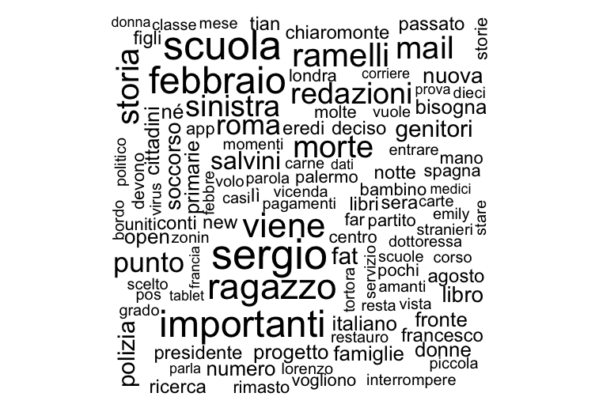
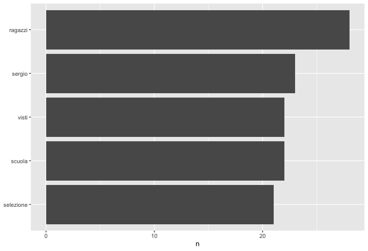
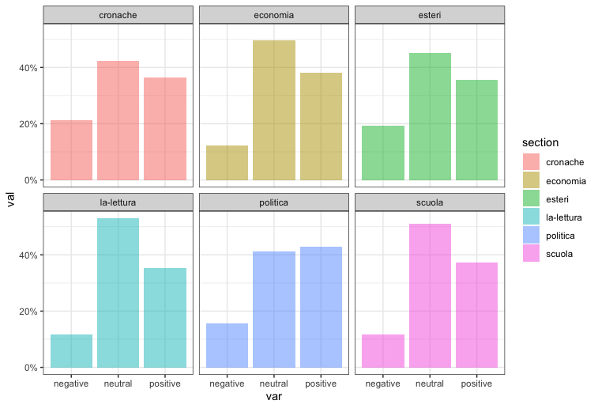
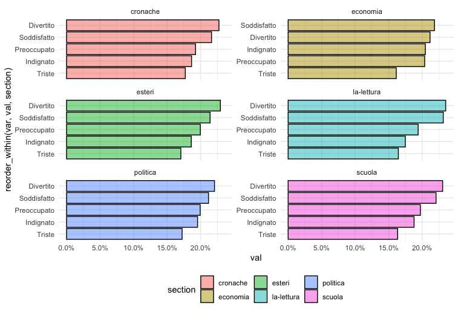
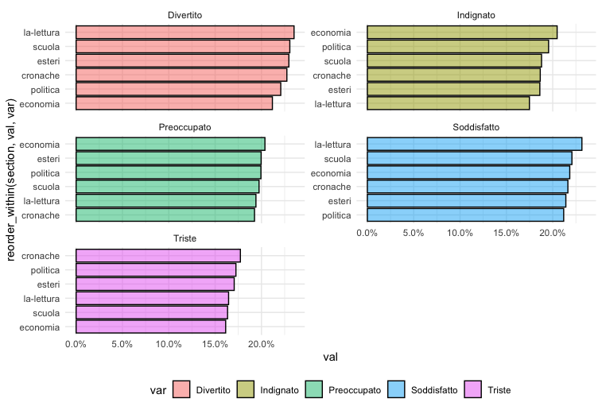

```{r setup, include=FALSE}
knitr::opts_chunk$set(echo = TRUE)

```
## *The use of words in newspapers*

### **Introduction**
During the '80s researchers considered journalist as creators of news, the responsible of the form that an event takes within the society. Gans explicitly sustain the idea that anything is a news originally: the news are just what journalists share with the public and the way in which they do that. (Spelndore 2017)

The core idea of this project is to test this perspective, analysing and comparing the way in which events are reported and represented in different newspapers. The political orientation is the way in which we decided to classify newspapers assuming that journalism may be considered a practice partially influenced and constituted by its relations with politics. (Splendore 2017)

##### **Assumptions**
At the basis of this project there are two assumptions: 

1. The political orientation of newspapers may have an influence on its contents; 

2. Words are powerful tools in creating, reproducing and representing events. 

### **The project**
The research question of this project aims to discover whether newspapers positioning themselves in different political areas presents the news in different ways. Specifically, the hypothesis is that different newspapers presents news in different ways.
We selected three newspapers ans then we scraped the articles presents on the homepage on February 17. The newspapers object of this project are:

- Libero, representing the right-ring;

- Il Corriere della Sera, representing the center-ring;

- La Repubblica, representing the left-ring.

Our objective is achieved conducting sentiment, emotional and text analysis of these articles. 
The sentiment and emotional analysis use dictionaires and some algoritms to evaluate the feelings expressed in one text looking at the words used; the text analysis is more observational and descriptive: it allows you to have a look at the frequency of the words used in the articles. 

The analysis of this project involves two levels:

1. An internal level, which means looking at the internal average of sentiment of the newspaper and how it is distributed between sections. At this purpose we created the variable *"section"* that may be useful to contestualize the use of some words, their frequency and the sentiments emerging from the articles.

2. An external level, which is about the comparison between the various newspapers. This part allows us to accept or reject our starting hypothesis.  

#### **Team's organization**
Each one of us partecipied in all the phases of the project, since we decided it would be best to not assign a specific task to a single member. But in general, to each member was assigned a newspaper. This decision depends on two main reasons:

- All of us were interested in improving and testing our skills in all the differentn phases of the project;

- Each newspaper required different css in the scraping part and different manipulation of the data in order to obtain a clear dataset.

### **Scraping**
Scraping the articles of the various homepages is the focal part of the project. 
To scrape the pages we used four different packages that we learned to use during the course of Data Access and Regulation II. These packages are: 

- RCurl, 

- tidyverse, 

- rvest,

- stringr, which allows us to work with strings. 

##### **Difficulties**
The hardest part in this phase was to discover the correct css to obtain the links. 

```{r, eval=FALSE}
#selecting the links of the articles
links <- read_html(here::here("/data/Ilcorrieredellasera1402.html")) %>% 
  html_nodes(css = ".is-8 .has-text-black , .is-pd-t-0 > .bck-media-news") %>% 
  html_attr("href")

links
```
This was the phase that required more times to be completed. 

### **Analysis**
In the first part of the analysis I used the package *"tidytext"*. 
The first task was to tokenize the articles, meaning that we must divide the text in separate words.To do that, the function required to convert the *articlestext* variable (containing the text of the articles scraped) from a factor to a character. 

##### **Pre-processing**
Pre-processing is a fundamental phase to conduct the analysis because it allows you to clean data. In this part I removed digits, punctuation and stopwords. To remove stopwords I used a new package *stopwords*. 

##### **Text analysis**
In this part I created a dataset containing only words. This was the dataset I used to look at the word frequencies.
In the entire set of data I obtained the following results:

Fig. 1: wordcloud in the entire dataset 

 


Fig. 2: five most used word in the entire dataset.



I also looked at the words most used in the articles scraped considering the sections. I considered five main sections: *"economia", "cronaca", "scuola", "la-lettura" and "esteri"*. To obtain the frequencies divided for sections I used a dataset which contains also the variable *section* (dat3). 

##### **Sentiment and emotional analysis**
This is the most important phase of the project. This part is divided in three moments:

1. The first part is about the uploading of the sentiment lexicon and then of the dictionaries needed to conduct the sentiment analysis;

2. In the second part I imported the dataset **datcharacter** in which the text of the article was converted from factor to character. Then I created a new dataset **data_sentiment** that will be used to conduct both sentiment and emtional analysis. The dataset contains only two variables: text and section, which is particularly useful because in the analysis we will compare the sentiment expressed in the different sections.
 
 3. In the third part we conducted the analysis.
        
        
##### **Sentiment analysis**
This kind of analysis is also defined a sentiment analysis with discrete categories because it considers three defined categories of sentiment: positive, negative and neutral.
Firstly I created a corpus and a dfm that allows us to arrange documents on the basis of the document's variables, *section* in this case. 
Then, I created a graph showing the percentage of each category of sentiment (negative, neutral and positive) for each section.

Fig. 3 Sentiment analysis for each section



From this analysis it is possible to observe that in the newspaper *Il Corriere della Sera*:

- the section that displays the higher percentage of **positive sentiment** is **"politica"**, meanwhile it is about the same for the other sections; 

- the level of **neutral** sentiment is high on average. **"La-lettura"** is the section that contains the higher percentges, followed by **"economia"**;

- **negative emotions** represent in average less than 20% of sentiment in all the sections. **"Cronaca"** and **"esteri"** are the sections with higher level. 


#### **Emotional analysis**
Emotional analysis is considered a sentiment analysis with continuous categories because it refers to more specific emotional dimensions. In this analysis there are five dimensions: *indignation, concern, sadness, happiness and satisfaction*. 
We obtained two inverted graphs:

Fig. 4 Percentages of each emotional dimension in each sections. 



From this graph we can say that almost all the sections (at the exception of "economia") present **"Divertito"** as the most frequent emotion meanwhile **"Triste"** is the emotion with the lower percentage in all the sections.

The positioing of **"Soddisfatto", "Preoccupato" e " Indignato"** is about the same for each section, meaning that the journal has a coerent style in the use of words and emotion transmitted. 


Fig. 5 Percentage of emotional dimension in sections 



This graph displays the distribution of the emotional dimensions in the different sections. As observed above, **"Divertito"** has an high percentage in each section. Also **"Soddifatto"** seems to be a frequent emotion. **"Preoccupato"** and **"Indignato"** are less frequent meanwhile **"Triste"** is the emotional dimension with the lowest frequence. 

### **Comparative analysis and results**
In this part we created a dataset (**/data/comparative_dataset.Rdata**) that contains values from all the dataset of the members of the team. In this dataset we added the variable *"newspaper"* that allows us to compare data of the three journal and observe the hypothesis we did in the explanation of the project. 

Firstly I created a corpus and a dfm defining as group "newspaper". Then I used some measures to look at the similarity or difference between vocabulary used in different dataset, that represents different newspapers. 

- **cosine method**: is a measure of similarity between two texts, based on the angolar distance between two vectors.

Looking at the results we can observe that the texts are more similar between *Il Corriere della Sera* e *Libero Quotidiano*. The similarity of *La Repubblica* with the other two newspapers is about the same, meaning that *La Repubblica* uses a different vocabulary than the others.

- **jaccard**: it is a measure of similarity based on the number of words in common at regard of the total number of words.
Looking at the results it can be said that the three considered newspapers use a low number of common words.

Secondly I created a corpus and a dfm defining as group "sections". Then I used the same measures: considering cosine method I observed that there is an high level of similarity between all the sections meanwhile using jaccard I observed that there is a low level of common words. 

### **Understanding the branch** 
In the brench there are five folders:

***1. Data***: it contains the homepage of Il Corriere della Sera (17/02) saved into an html page: Ilcorrieredellasera1702.html, the folder ARTICLES in which the html pages of each article are stored and the saved dataset.

The saved dataset are: 

  - **dat**: it is the starting dataset, created after the scraping part of my analysis. It is composed by 30 observation (the articles published on the homepage on February 17) and 3 variables: link, articlestext, section. This dataset can be opened going to the folder data and then opening the file *Corrierearticles1702.Rdata*;
            
  - **datcharacter**: it is the dataset in which the text of the articles is saved as character;

  - **dat3**: it is the dataset in which the variable "word" is added. It presents 4 variables and 8440 observation. This dataset can be opened going to the folder data and then opening the file *IlCorriereDellaSera.Rdata*.

  - **corriere_words**: it is the dataset that contains only the words. It is constituted by one variable and 8440 observations. This dataset can be opened going to the folder data and then opening the file *IlCorriereDellaSeraWORDS.Rdata*

  - **data_sentimet**: it is the dataset used to conduct both sentiment and emotional analysis.

  - **comparative_dataset**: it contains the dataset about the three newspapers. 


***2. SRC***
This folder contains the scripts:
1. **00_setup**: it is the script containing all the used packages and the library of them; 
2. **01_scraping**: it is the script which contains the scraping part;
3. **02_textanalysis**: it is the script that contains 
   - the part of *tokenization* and *pre-processing*;
   - the part about *word frequencies* 
4. **03_sentiment**: it is the script containg the sentiment analysis. 
5. **04_comparative analysis**: it is the script about the comparison between the data about the three newspapers. 

***3. JUNK***
This folder contains all the things I didn't want to delate bur I no longer needed. 

***4. DICTIONARY*** 
This folder contains the dictionaries used to conduct the sentiment analysis.
 
***5. FIG***
This folder contains the graphs with descriptive names. 

### **What I learned**
During the development of the project we were free, for the first time, to create a personal project: chosing the topic and being free to conduct any kind of analysis and to use any kind of package we know. From the course, of sure, I learned at looking behind what I already know and to try to find a solution also when it seems impossible. Developing this skills meant that we searched for resources everywhere and we discovered new useful packages. We contacted Federico Vegetti, asking him some materials about the sentiment and emotional analysis and he gives us a fundamental resource, that is what allowed us to complete the project. 
It was challenging working in a group. Sometimes it's more esier making things alone because of the absence of the necessity to coordinate the work but for sure working with my colleagues has make this project more complete and accurate. Working on this project allowed me to better learn how to use GitHub.

### **Comments**
The project obviously presents some limits. It would be better if we had a large number of observation: we could have scraped the articles of many days or we could have included many newspapers, for instance. The analysis could have be more precise, but I think this project was an important step in developing our skills in the research field. 

Fabiana Gemma Giannuzzi 

